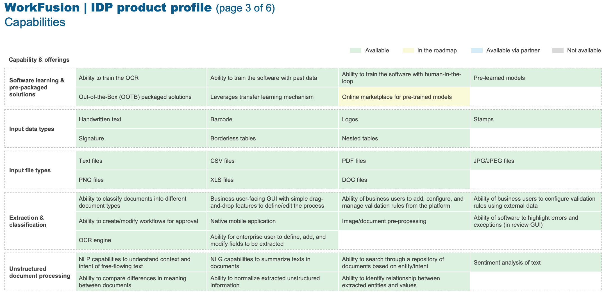

- 为什么所有星球都是圆形的？
	- 行星是圆形的，因为**引力**使它们如此。行星是由围绕恒星运行的气体和尘埃粒子产生的。由于引力，颗粒相互吸引并形成越来越大的团块。当粒子碰撞时，它们会升温并变成液体，引力将其拉向行星的中心。由于**引力从各个方向均匀地吸引物质**，因此**熔融物质形成一个球体**，而不是立方体或四面体。这就是为什么行星都是圆形的。
- IDP 调研文章 [Straits Research](https://www.globenewswire.com/en/news-release/2022/08/24/2504154/0/en/Intelligent-Document-Processing-Market-Size-is-projected-to-reach-USD-6-38-Billion-by-2027-growing-at-a-CAGR-of-35-4-Straits-Research.html)
- **The prominent players in the intelligent document processing market include**
	- *ABBYY*
	- *IBM*
	- *Kofax*
	- *WorkFusion*
		- 
		- 
		- 
		-
	- *Automation Anywhere*
	- *Appian*
	- *UiPath*
	- *Datamatics*
	- *AntWorks*
	- *Parascript*
	- *Hyperscience*
	- *OpenText*
	- *Hyland*
	- *Extract Systems*
	- *Infrrd*
	- *Celaton*
	- *HCL Technologies*
	- *Kodak Alaris*
	- *Rossum*
	- *InData Labs*
	- *Ephesoft*
	- *IRIS*
	- *Evolution AI*
	- *BIS*
	- *AmyGB*
- 
-