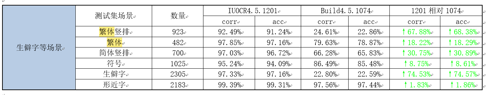

- 视频抽帧
	- ffmpeg -i "插入排序.m4v" -r 0.1 -q:v 2 -f image2 %d.jpeg
- 我的「教学类视频」制作流程：
  1.脚本制作
  2.旁白制作
  3.录音
  4.音频剪辑
  5.视频素材制作
  6.视频剪辑
  7.标题、简介、缩略图
  8.检查和上传
-
- 是否支持繁体字的确认
- 确认小样本训练的配置
- 有可能需要携带GPU卡到客户现场
- 
- 单T4卡（显存16G）训练2.5小时
- 单T4卡跑三路服务
- 单T4卡每小时吞吐6700张，一张2秒。
-
- 通用新版本引擎15号，图聆还没定。
-
- 小样本训练平台如果要替换最新的识别引擎需要多少工作量？可以很快替换吗？
-
- 小样本训练平台功能点
	- 数据集管理，支持数据集的添加、删除以及查看数据集的标注状态。
	- 数据标注，对训练需要使用的数据集进行标注，支持
	- 模型训练，使用标注好的数据集进行模型的训练，整个训练过程自动化完成，无需人工介入。
	  id:: 63e36793-7011-4d0a-a4c9-61250c24d7b9
	- 模型测试，对训练出来的模型进行测试，给出可视化的测试结果，评估模型效果。
	- 模型管理，对训练出来的历史模型进行管理，可以查看模型使用的训练数据集，测试数据集，模型的效果。
	  id:: 63e36a97-20b8-4934-a2c6-255925dc5737
	- 模型部署，对训练出来的模型支持一键部署到集群。
	-
- 训练任务列表
	- 任务名称，用户创建自动学习任务时填写的任务名称信息，该任务名称在平台内唯一。
	  id:: 63e37e9e-aa5d-464b-a281-3ec160fe4b7e
	- 任务类型，用户创建自动学习任务时选择的任务模板。
	- 训练数据集，用户创建训练任务时选择的训练数据集，支持选择多个数据集作为该任务的训练数据输入。
	- 训练状态，当前任务训练状态数据展示，按照训练中、已完成、已停止三种类型展示当前的任务下训练状态。
	- 部署状态，当前任务训练部署数据展示，按照运行中、部署中、已停止三种类型展示当前的任务下服务部署状态。
	  id:: 63e37f26-14b7-471f-ad89-9c985b97489c
	- 操作
		- 查看，进入任务详情页面，查看任务详情。
		- 删除，删除当前任务。
	- 新增任务
		- 基础信息填写，在基础信息填写模块内输入任务名称，名称需要保证在平台内的唯一性。
		- 选择数据，在选择数据模块内选择用于模型训练的数据集，支持同时选择多个数据集。
- 训练任务详情
	- 数据标注
		- 已标注数据展示，展示当前任务下已标注的数据列表，点击具体的图片即进入数据标注页面，在数据标注页面查看当前数据标注详情。
		- 未标注数据展示，展示当前任务下未标注数据列表，点击具体的图片即进入数据标注页面，在数据标注页面对未标注的数据进行标注。
		- 添加图片，添加新的图片，对图片进行标注。
		- 删除图片，删除当前已标注/未标注的图片。
		- 数据标注，在数据标注页面查看图片详情，对图片添加name、key、value数据。
	- 模型训练
		- 开始训练，在数据标注页面，选择已标注好的数据开始训练任务。
		- 训练任务配置，配置当前的训练版本、版本备注、训练偏好、自定义训练次数等相关数据，确认完成任务配置信息后，即可开始任务的训练。
		- 训练中的任务，展示训练节点进度信息、训练详情、评估结果、训练日志信息。对于训练中的任务，支持停止以及删除操作。
		- 训练失败的任务，展示训练失败详情、查看训练失败日志查看入口。对于训练失败的任务，仅支持删除操作。
		- 训练成功的任务，展示训练节点进度信息、训练详情、评估结果、要素准确率以及详细数据展示。对于训练成功的任务，支持部署以及删除操作。
	- 服务部署
		- 模型部署，对已训练成功的任务进行模型部署，只有已训练成功的任务才可部署。
		- 部署中的服务，展示当前模型的部署进度，对于部署中的服务，支持停止以及删除操作。
		- 运行中的服务，展示URL接口地址，对于运行中的服务，支持停止以及删除操作。
		- 已停止的服务，对于已停止的服务，支持启动以及删除操作。